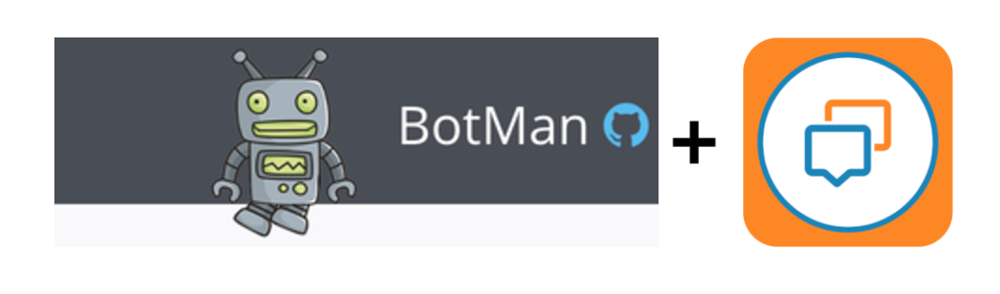
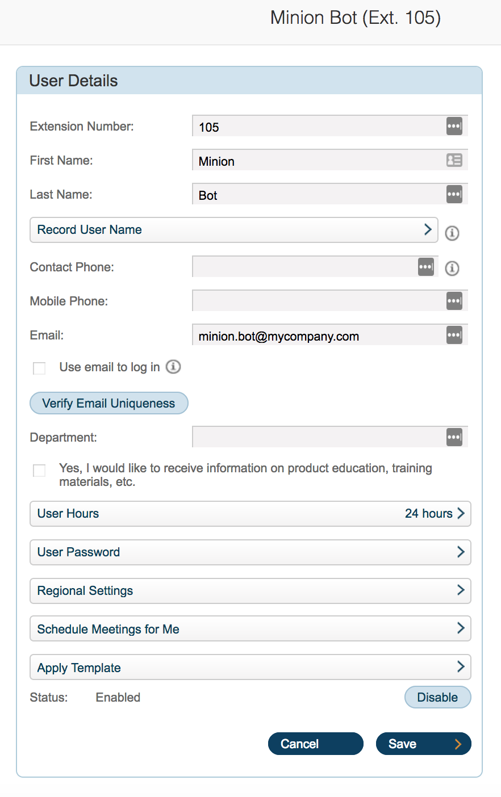
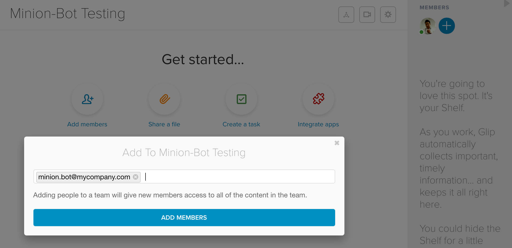
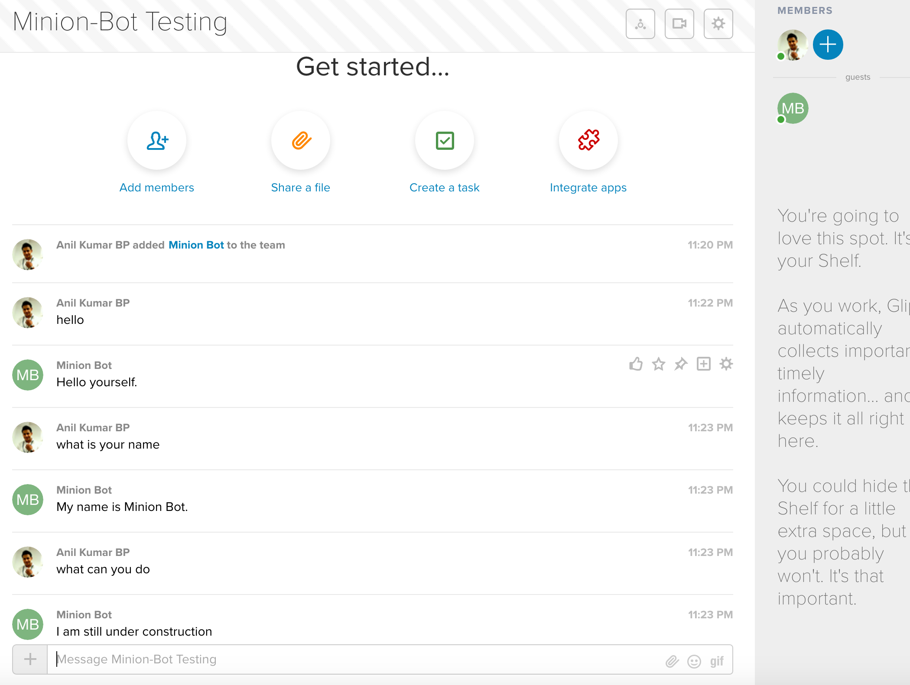

# Glip - Botman

[Glip](https://glip.com/) Adaptor for [Botman](https://botman.io/1.5/installation).



This is a simple Botman Adaptor for Glip which is ready to use and fairly simple to install. Before we install, lets look at the requirements below:
 
 
## Requirement

 - PHP 5.5+ 
 - CURL extension
 - MCrypt extension
 
Note: for PHP v 5.6 you would need to comment the below line in the `php.ini` file.  
"always_populate_raw_post_data = -1" 

## Installation & Setup

### Via Github Repo
```php
$ git clone https://github.com/anilkumarbp/glip-botman.git
$ cd glip-botman
$ curl -sS https://getcomposer.org/installer | php
$ composer install
```
### Via Composer 

Require this package with composer using the following command:    
```php
$ composer require anilkumarbp/glip-botman
```

Require Composer's autoloader in your PHP script ( index.php ) assuming it is in the same directory where you installed Composer :
    
```php
require('vendor/autoload.php');
```
    
## Configure your Bot

### Provide Bot User details in `.env` file:

```php
$ vi .env
```


Edit the .env file to copy the below and edit the app details and user details.

```php
    GLIP_SERVER=https://platform.devtest.ringcentral.com        // Server Url ( Production: https://platform.ringcentral.com || Sandbox: https://platform.devtest.ringcentral.com )
    GLIP_APPKEY=appKey                                              
    GLIP_APPSECRET=appSecret                                     
    GLIP_USERNAME=Username                                  
    GLIP_PASSWORD=Password                                
    GLIP_EXTENSION=Extension                                
```

### Define an Application in RingCentral

In order to communicate with the RingCentral API, you will need to have RingCentral API Keys for the appropriate environment, either **Sandbox** or **Production**.
 
 1. Login to the Developer Portal [https://developer.ringcentral.com/login.html#/](https://developer.ringcentral.com/login.html#/) if you haven't already. 2. Click on 'Create App' to define a new application
    * **Application Name:** Your choice, but something easy to identify and associate with purpose is good
    * **Description:** Your suitable description for the application. 
    * **Application Type:** Private
    * **Platform Type:** **Server-only (No UI)**
    * **Permissions Needed:**
        * Glip
        * Webhook Subscriptions

Note : This bot uses [Webhook Based Subscriptions](https://developer.ringcentral.com/api-docs/latest/index.html#!#RefCreateSubscription) to Listen to conversations posted on Glip

For more information on Webhooks, refer to our [QuickStart Guide on Webhooks](http://ringcentral-quickstart.readthedocs.io/en/latest/webhooks/) 

## Usage 

Note: The demo assumes that you are not using a Live server instead the PHP's [Built-In Web server](http://php.net/manual/en/features.commandline.webserver.php) and the tunneling service from [ngrok](https://ngrok.com/).

### Start the PHP built-in Web Server locally

```php
$ cd glip-botman
``` 
```php
$ php -S localhost:8080
```

### Start ngrok ( Optional )
For demo purposes we are using ngrok.
 
Open another terminal and:
```bash
$ ngrok http 8080
```

### Setup Webhook URL for the Bot
Just point the webhook subscription URL to: ( you must start ngrok if using it ) lets say the above step gives you an endpoint for the server as below:
```php
https://f0aad057.ngrok.io/index.php
```
Add this to the .env parameter `GLIP_WEBHOOK_URL` created above. 

## Start the Bot

In the terminal, just run this command:

```php
$ cd glip-botman
```

```php
$ php index.php
```

If its successful, you will get a message as below : 

**Wohooo, your Bot is Registered. Please follow the instructions on on-boarding the bot into Glip**

## On-Boarding Bot into Glip
1. **Assign a Name and Unique Email Address to the Bot**  
     https://service.devtest.ringcentral.com
 
 
**Note:** The above user refers to the same user whose credentials was used in the `.env` file to configure the bot.
  
2. **Invite the bot into a group using the email ID**  
     https://glip.devtest.ringcentral.com/
 

**Note:** Create a group on `Glip` and invite the Bot using `Add Member` button on the top extreme right.
 
3. **Start chatting with the Bot**
 
 
## Extending the Botman-Glip Adapter

You can set the `Bot` to listen to any specific commands/instructions . You can include the commands in the php file whihc is used to setup the Webhook. In our case, it is `webhook.php`

```php
// Give the bot something to listen for.
$botman->hears('hello', function (BotMan $bot) {
    $bot->reply('Hello yourself.');
});


$botman->hears('how are you doing', function (BotMan $bot) {
    $bot->reply('I am fine how are you doing today ?');
});
```

For more details, please take a look at Botman's official guide on [Hearing Messages](https://botman.io/1.5/receiving)


## Dependencies

Currently used RingCentral-PHP SDK version for this demo:  
[ "ringcentral/ringcentral-php": "^2.0.0"](https://github.com/ringcentral/ringcentral-php)  
["mpociot/botman":"latest"](https://github.com/mpociot/botman)

* Make sure to change the SDK version in the composer.json before you chose to use a different SDK Version.


## Links

Project Repo

* https://github.com/anilkumarbp/glip-botman

RingCentral SDK for PHP

* https://github.com/ringcentral/ringcentral-php

RingCentral API Docs

* https://developer.ringcentral.com/api-and-docs.html

RingCentral API Explorer

* https://developer.ringcentral.com/api-explorer/latest/index.html

## Contributions

Any reports of problems, comments or suggestions are most welcome.

Please report these on [glip-botman's Issue Tracker in Github](https://github.com/anilkumarbp/glip-botman/issues).

## License

RingCentral SDK is available under an MIT-style license. See [LICENSE.txt](LICENSE.txt) for details.

RingCentral SDK &copy; 2017 by RingCentral

## FAQ

* What if I do not have a RingCentral account? Don't have an account, no worries: [Become a RingCentral Customer](https://www.ringcentral.com/office/plansandpricing.html)
* I/My company is an Independent Software Vendor (ISV) who would like to integrate with RingCentral, how do I do that? You can apply to [Join the RingCentral Partner Program](http://www.ringcentral.com/partner/isvreseller.html)


